# System Architecture - Hybrid Post-Quantum Cryptographic Wallet

## High-Level System Architecture

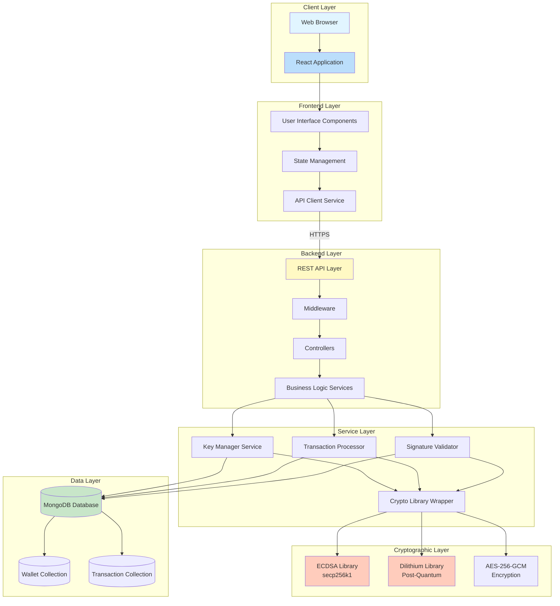

## Component Architecture

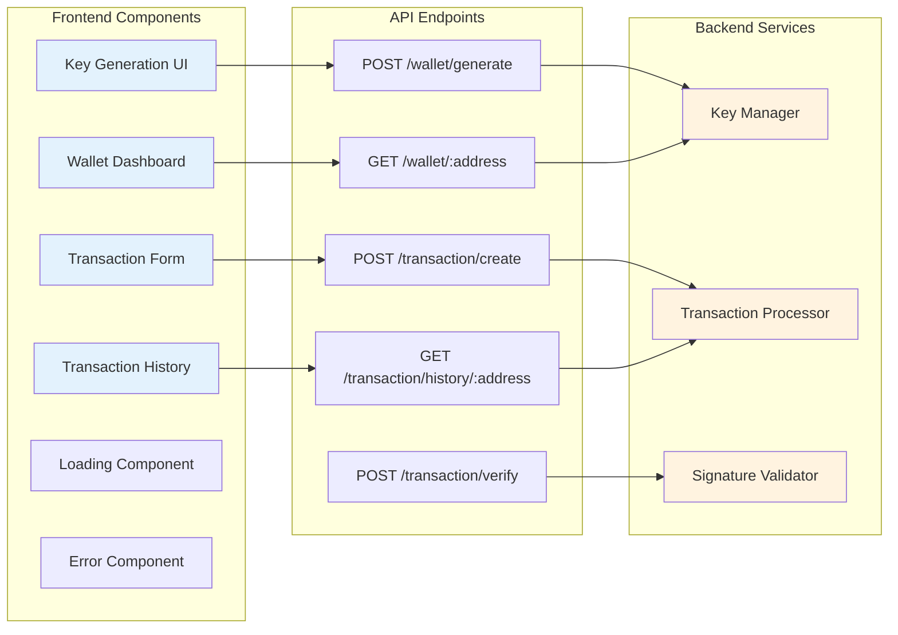

## Data Flow Architecture

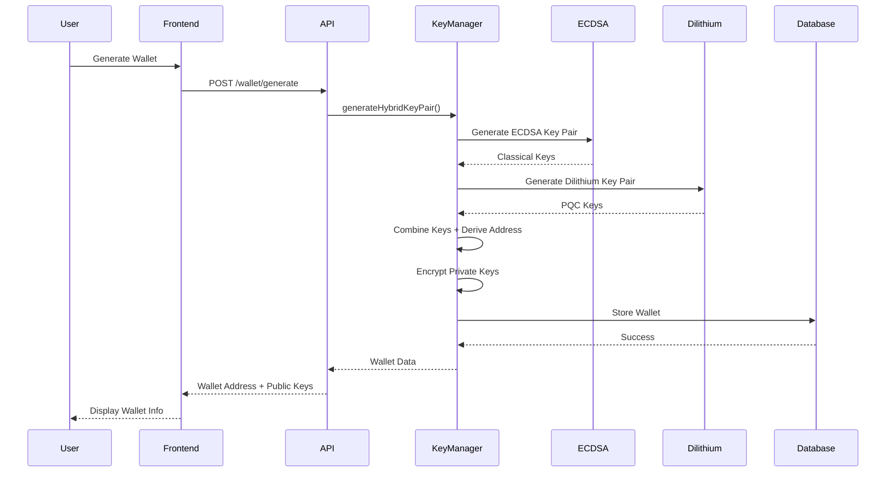

## Transaction Flow Architecture

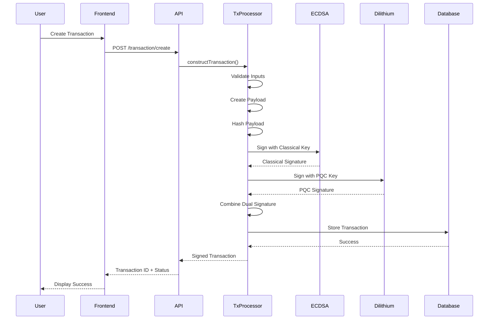

## Signature Verification Flow

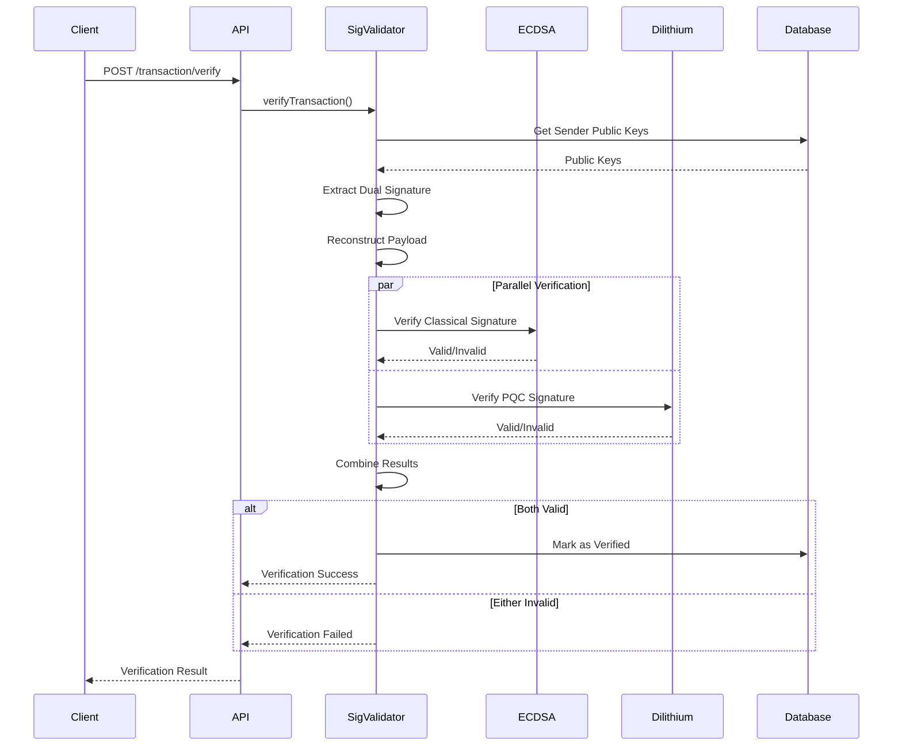

## Database Schema Architecture

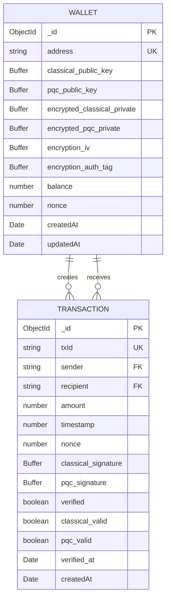

## Security Architecture

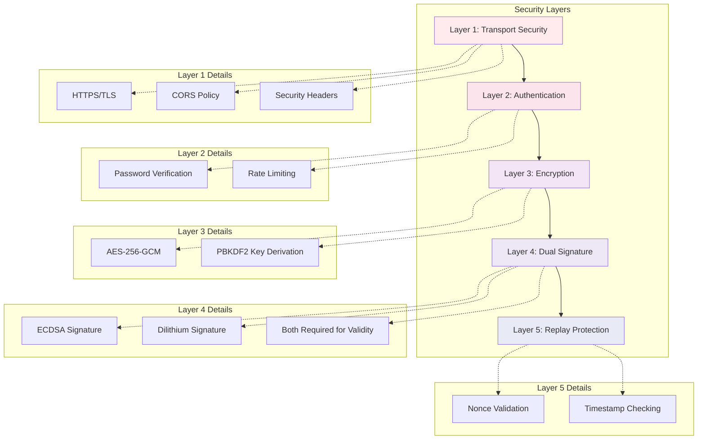

## Deployment Architecture

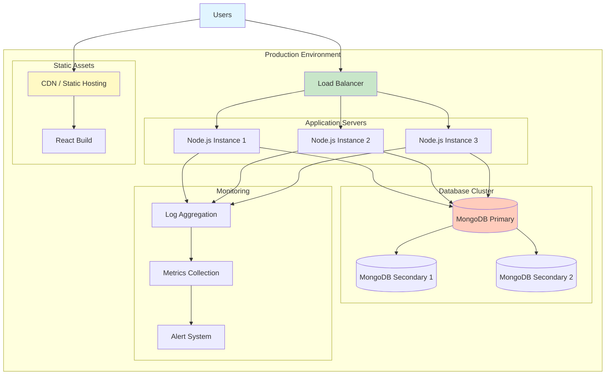

## Technology Stack Diagram

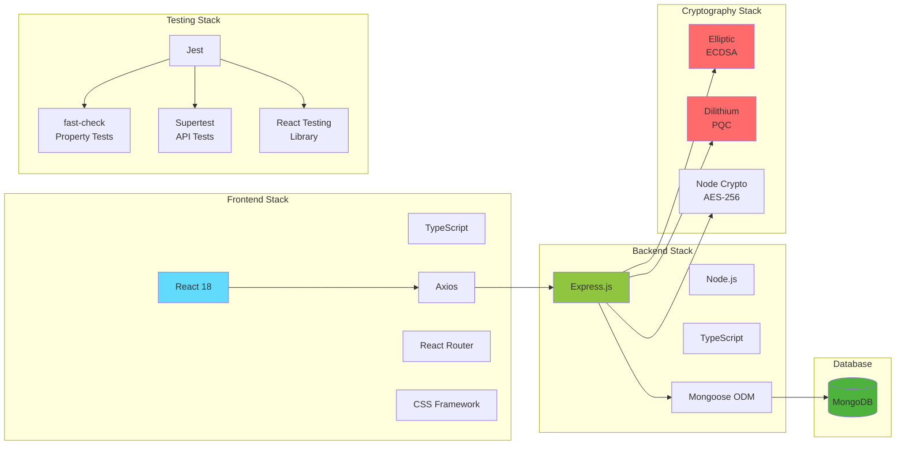

## Key Generation Process

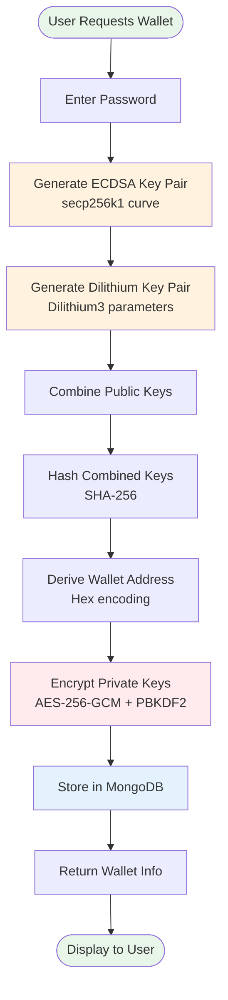

## Transaction Signing Process

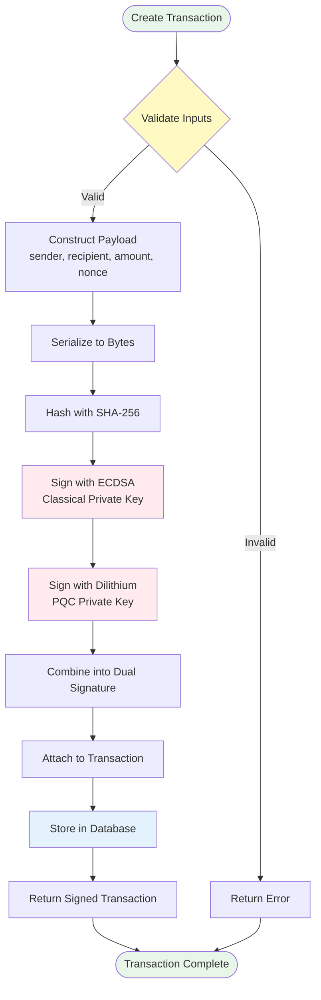

---

## Architecture Principles

### 1. **Separation of Concerns**
- Frontend handles UI/UX only
- Backend handles business logic and cryptography
- Database handles persistence

### 2. **Security by Design**
- Multiple layers of security
- Dual signature requirement
- Encrypted storage
- No private key transmission

### 3. **Scalability**
- Stateless API design
- Horizontal scaling capability
- Database indexing for performance

### 4. **Maintainability**
- Clear component boundaries
- TypeScript for type safety
- Comprehensive testing strategy

### 5. **Future-Proof**
- Post-quantum cryptography ready
- Modular design for algorithm updates
- Extensible architecture

